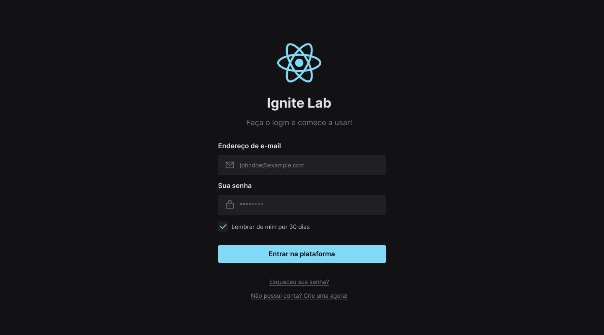

<h1 align="center">
  Design System | Ignite Lab
</h1>

  
  
  
  

 

  

## 💻 Projeto

Criamos a base visual do nosso Design System no Figma, definimos quais tokens utilizaríamos e os componentes que fariam parte da biblioteca em React. Em seguida, exportamos os tokens e componentes do Figma para o código, criando a base do projeto em React e a documentação utilizando Storybook.

## ✨ Tecnologias
Essa aplicação foi desenvolvida com as seguintes tecnologias:

- [React](https://reactjs.org)
- [TypeScript](https://www.typescriptlang.org/)
- [Tailwind](https://tailwindcss.com/)
- [Radix UI](https://www.radix-ui.com/)
- [Storybook](https://storybook.js.org/)
- [Figma](https://www.figma.com/)

## 📖 Conhecimento
Com esse projeto, utilizei:
- `tailwind css` para estilização e criação de temas;
- `radix ui` para tornar o modal acessível;
- `storybook` para tornar o modal acessível;

## Utilização do projeto

### 💾 Baixar o projeto
Faça o clone do repositório para ter uma versão do projeto em sua máquina: 
`$ git clone https://github.com/mmanaclara/ignite-lab-design-system.git`

### 🧰 Instalar dependências
`$ npm install ou yarn`  

### 🚀 Iniciar o projeto
`$ npm run dev ou yarn dev`
 
Agora você pode acessar [`http://127.0.0.1:5173`](http://http://127.0.0.1:5173/) do seu navegador.

## 📝 Licença
Este projeto está licenciado nos termos da licença [MIT](https://github.com/mmanaclara/ignite-lab-design-system/blob/main/LICENSE). 